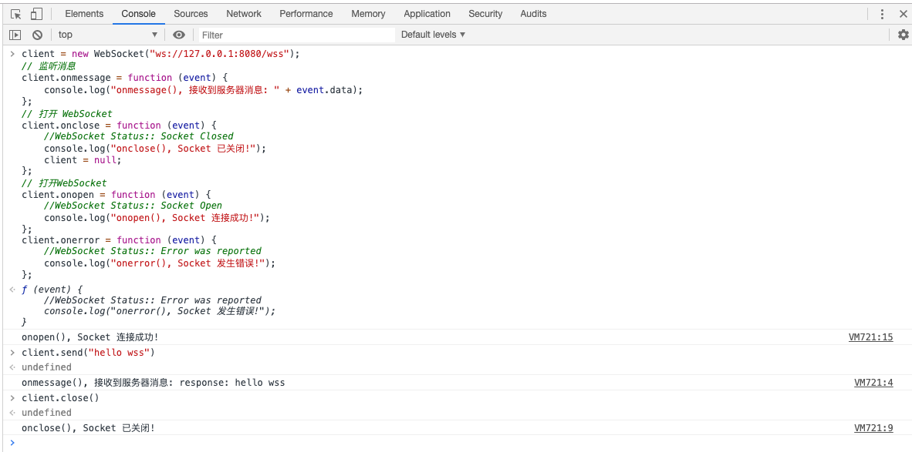

### wss

1. websocket demo
2. https://docs.spring.io/spring-framework/docs/5.2.0.M1/spring-framework-reference/web.html#websocket


#### 效果




#### 使用GitHub Package Registry发布

1. settings 设置
   ```xml
           <activeProfiles>
               <activeProfile>github</activeProfile>
             </activeProfiles>
           
             <profiles>
               <profile>
                 <id>github</id>
                 <repositories>
                   <repository>
                     <id>central</id>
                     <url>https://repo1.maven.org/maven2</url>
                     <releases><enabled>true</enabled></releases>
                     <snapshots><enabled>true</enabled></snapshots>
                   </repository>
                   <repository>
                     <id>github</id>
                     <name>GitHub OWNER Apache Maven Packages</name>
                     <url>https://maven.pkg.github.com/lishulongVI</url>
                   </repository>
                 </repositories>
               </profile>
             </profiles>
   
           <servers>
               <server>
                 <id>github</id>
                 <username>USERNAME</username>
                 <password>TOKEN</password>
               </server>
            </servers>
   ```

2. pom.xml 
    ```xml
        <distributionManagement>
           <repository>
             <id>github</id>
             <name>GitHub OWNER Apache Maven Packages</name>
             <url>https://maven.pkg.github.com/OWNER/REPOSITORY</url>
           </repository>
        </distributionManagement>
   ```

3. 执行命令 进行上传mvn deploy -Dmaven.test.skip=true
